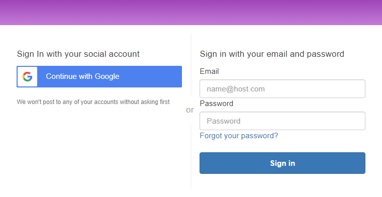

## Problem
*Let's consider this scenario.*  
We have a web app where our users can login to it. For authentication, we have setup Amazon Cognito with [federated sign-in](https://docs.aws.amazon.com/cognito/latest/developerguide/cognito-user-pools-identity-federation.html) for Google. 



Now, we have a need to allow the admin users as well to login. All our admin users have email with domain `@some-company.com`. This `@some-company.com` domain is managed through Google Workspace.

All our admin users have same access, features and capability. We do not need a fine-grain access mechanism.

## Solution
### Pre-requisites
- Understanding of Amazon Cognito
- Working setup of Cognito with Federated identity pool
- Some working understanding of OAuth2

Since all the admin have same level of access, there is no need to setup an exhaustive authorization mechanism. All we need is a special claim on JWT token to identify the user as admin.

To do this, we will be leveraging Cognito UserPool Group capability.
When an user signs into the app for the first time, we will look at the domain part of the email and if it matches our company domain, we will add the user to the user group that we have created for admin users.

### Create UserPool Group
We will first create a [group](https://docs.aws.amazon.com/cognito/latest/developerguide/cognito-user-pools-user-groups.html) in our Cognito User Pool.

*Cloudformation for creating group*
```yaml
  AdminUserPoolGroup:
    Type: AWS::Cognito::UserPoolGroup
    Properties: 
      Description: Group which contains admin users.
      GroupName: !Ref AdminGroupName
      UserPoolId: !Ref UserPool
```

### Post Confirmation Lambda
We will be using [Lambda triggers](https://docs.aws.amazon.com/cognito/latest/developerguide/cognito-user-identity-pools-working-with-aws-lambda-triggers.html) capabilities of Cognito, especially [Post Confirmation](https://docs.aws.amazon.com/cognito/latest/developerguide/user-pool-lambda-post-confirmation.html) Lambda trigger.

The Post Confirmation Lambda is triggered only when an user is signed into the app for the first time, in our case, using the Google login button.

```ts
const AWS = require('aws-sdk');

exports.handler = async (event, context, callback) => {
  const { userPoolId, userName } = event;
  const email = event.request.userAttributes.email;
  const groupName = process.env.ADMIN_GROUP_NAME;

  try {
      if (doesEmailBelongToAdminDomain(email)) {
      await addUserToGroup({
        userPoolId,
        username: userName,
        groupName,
      });
    }

    return callback(null, event);
  } catch (error) {
    return callback(error, event);
  }
};

const doesEmailBelongToAdminDomain = (email) => {
  const adminEmailDomainName = process.env.ADMIN_EMAIL_DOMAIN_NAME;
  // Split the email address so we can compare domains
  const address = email.split("@");

  if (adminEmailDomainName === address[1]) {
    return true;
  }
  return false;
};

const addUserToGroup = ({
  userPoolId,
  username,
  groupName,
}) => {
  const params = {
    GroupName: groupName,
    UserPoolId: userPoolId,
    Username: username,
  };

  const cognitoIdp = new AWS.CognitoIdentityServiceProvider();
  return cognitoIdp.adminAddUserToGroup(params).promise();
};

```
### Token
After this setup, if you login with the company domain email, you will get a token that looks like the one below:
```json
{
  "sub": "9893sae2-b60d-7869-ac7d-2807fec7f2ab",
  "iss": "https://cognito-idp.us-east-1.amazonaws.com/us-east-1_Oph34e1i7",
  "version": 2,
  "client_id": "8968i9neasfgjq0kk864vkhb",
  "cognito:groups": [
    "admin",
    "userpool_231as3dgf"
  ]
  "origin_jti": "388aff43-2d15-4640-82f7-340a16755724",
  "event_id": "e798a740-af00-4247-9321-67f2050b5144",
  "token_use": "access",
  "scope": "openid",
  "auth_time": 1669805733,
  "exp": 1669809333,
  "iat": 1669805733,
  "jti": "c2d4f281-3f40-4cb2-a2c7-d193fefdc97c",
  "username": "9893sae2-b60d-7869-ac7d-2807fec7f2ab"
}
```
You will find that the `cognito:groups` claim will contain the name of the UserPool group you create above. This would indicate that the user belongs to admin group and you can use for authorization.