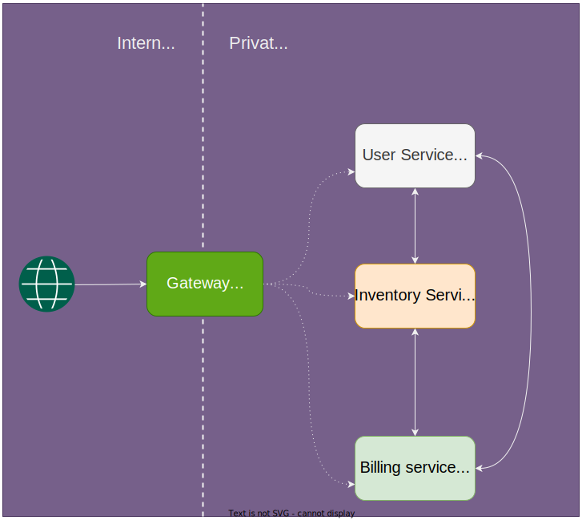

Sometimes you may need to separate authorization and authentication in NestJS.

## Separation of concerns
*Let's consider this scenario.*  
We want to build a system based on microservices and all of the services are built using NestJS.  
The services are split across [domains](https://martinfowler.com/bliki/DomainDrivenDesign.html). We also have a `Gateway` which act as the entry point for the system and it takes care of authentication.



Assumptions:
- Basic understanding of NestJS
- Understanding of how [Authentication](https://docs.nestjs.com/security/authentication) works in NestJS

## Authentication
NestJS uses PassportJS for authentication. PassportJS has the concept of strategy which simplifies different authentication protocols/methods.  
Here, we use JWT based token validation based on OAuth2. We provide the necessary configuration to the constructor of `PassportStrategy`
```ts
import { Injectable } from '@nestjs/common';
import { ConfigService } from '@nestjs/config';
import { PassportStrategy } from '@nestjs/passport';
import { ExtractJwt, Strategy } from 'passport-jwt'
import { passportJwtSecret } from 'jwks-rsa';
import { IdentityProviderConfig } from '../../configuration';

@Injectable()
export class AuthenticationStrategy extends PassportStrategy(
  Strategy,
  'authn',
) {
  constructor(configService: ConfigService) {
    const idpConfig = configService.get<IdentityProviderConfig>('idp');
    super({
      secretOrKeyProvider: passportJwtSecret({
        cache: true,
        rateLimit: true,
        jwksRequestsPerMinute: 5,
        jwksUri: `https://${idpConfig.url}/.well-known/jwks.json`,
      }),

      jwtFromRequest: ExtractJwt.fromAuthHeaderAsBearerToken(),
      ignoreExpiration: false,
      issuer: `https://${idpConfig.url}`,
      algorithms: ['RS256'],
    });
  }

  public async validate(payload: any): Promise<any> {
    return !!payload.sub;
  }
}

```

## Authorization
In NestJS, authorization happens via `Guard`. Here, we create the simple guard which authorized the requestor based on a claim called `scope` in jwt token.

```ts
import { CanActivate, ExecutionContext, mixin, Type } from '@nestjs/common';
import { AuthGuard } from '@nestjs/passport';
import { Scope } from '../scope.enum';

export const ScopeGuard = (scope: Scope): Type<CanActivate> => {
  class ScopeGuardMixin extends AuthGuard('authz') {
    async canActivate(context: ExecutionContext) {
      await super.canActivate(context);

      const request = context.switchToHttp().getRequest();
      const token = request.user; // decoded token
      return token?.scope.includes(scope);
    }
  }

  const mix = mixin(ScopeGuardMixin);
  return mix;
};

```
You can definitely decode the jwt token within the `Guard`. But, I like to separate it into a separate class. This `AuthorizationStrategy` simply decodes token and is added into the `request.user` object by the use of `PassportStrategy`.
```ts
import { Injectable } from '@nestjs/common';
import { ConfigService } from '@nestjs/config';
import { PassportStrategy } from '@nestjs/passport';
import { ExtractJwt, Strategy } from 'passport-jwt'
import { passportJwtSecret } from 'jwks-rsa';
import { IdentityProviderConfig } from '../../configuration';

@Injectable()
import { BadRequestException, Injectable } from '@nestjs/common';
import { PassportStrategy } from '@nestjs/passport';
import { Strategy } from 'passport-custom';
import * as jwt from 'jsonwebtoken';

@Injectable()
export class AuthorizationStrategy extends PassportStrategy(
  Strategy,
  'authz',
) {
  async validate(req: Request) {
    const header = req.headers['authorization'];
    const token = header.slice(7);
    if (!token) {
      throw new BadRequestException('There is no access token in header');
    }
    const decoded = jwt.decode(token);
    return decoded; // this decoded token can be accessed from request.user in Guard
  }
}


```